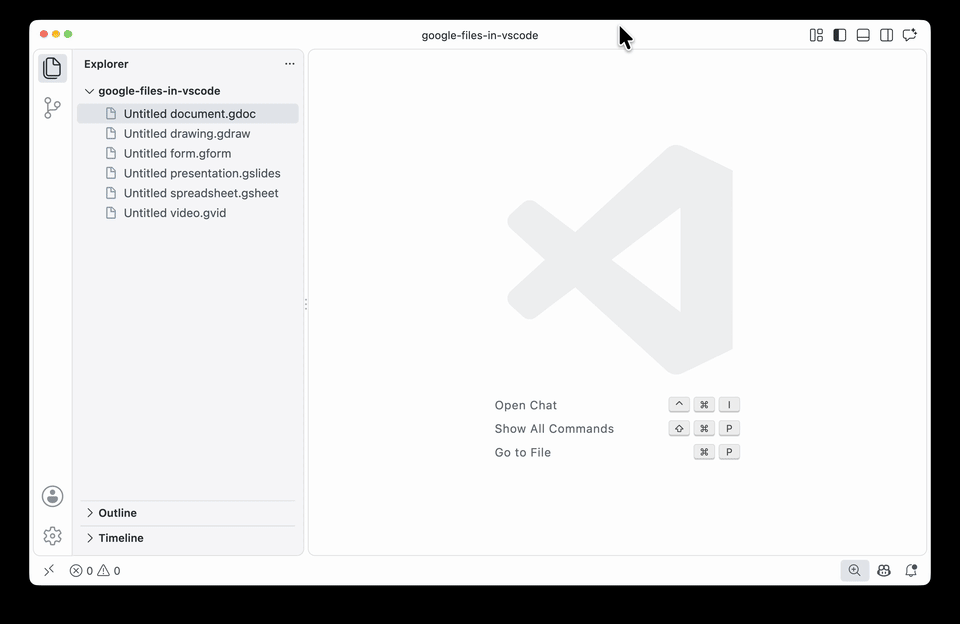

# Google Files in VS Code

<p align="center">
  
</p>

<p align="center">
  <a href="https://github.com/farazeid/google-files-in-vscode/blob/main/assets/demo.mp4">
    
  </a>
</p>

<p align="center"><a href="https://github.com/farazeid/google-files-in-vscode/blob/main/assets/demo.mp4">Watch the full 19-second demo</a></p>

## Abstract

Open Google Docs, Sheets, Slides, Vids, Forms, and Drawings shortcuts in VS Code's integrated browser.

Click a `.gdoc`, `.gsheet`, `.gslides`, `.gvid`, `.gform`, or `.gdraw` in the Explorer to open the linked document. Google handles viewing, editing, and saving in the browser; this extension only reads the local shortcut.

MIT licensed. This is an independent extension, not an official Google or Microsoft product.

## Limitations

**Version 0.1.0 opens a new browser tab per completed open.** It combines overlapping requests for the same document but does not reuse existing, manually opened, or restored tabs. It never closes browser tabs. This explicit first-release scope avoids relying on ambiguous tab identities in VS Code's current APIs.

The current validated environment is **macOS with desktop VS Code 1.138.0 and 1.139.0**. Windows, Linux, remote workspaces, virtual filesystems, and VS Code for the Web are not validated in this release. The extension does not scan your Drive folder, and never changes shortcut files.

Basic edit/save/reload checks passed for all six Google apps. Google login survived a VS Code restart. **Google Vids editing and saving worked, but rendered playback did not work in the integrated browser during testing.** Computer-reboot login persistence remains untested. See [manual acceptance](docs/manual-acceptance.md) for the tested scope.

The current fixture benchmark shows 102 ms median cold page readiness versus 93 ms in the earlier comparison extension run, with much faster shortcut cleanup. This cross-run comparison does not measure Google load time. The cold timing tradeoff and new-tab behavior were accepted for v0.1.0; see [performance evidence](docs/performance.md).

## Commands and recovery

- **Google Files: Open in VS Code** — route a selected shortcut into a browser tab.
- **Google Files: Open in External Browser** — explicitly open the linked document in your default browser.
- **Google Files: Show Diagnostics** — show version and compatibility information.

Opening errors keep a small panel with **Retry**. If a valid Google URL was resolved, **Open in External Browser** is also available. Invalid or unreadable files do not offer an unvalidated external destination.

Browser handoff times out after 15 seconds. A timed-out command may still finish; repeated requests stay blocked while it is pending. Reload VS Code if the command never settles. Closing a queued shortcut panel cancels its request; a browser command already executing cannot be undone.

Successful handoff means VS Code accepted the browser-opening command, not that Google finished loading. Google sign-in, access, and network errors remain visible in the browser. Use **Reopen Editor With → Text Editor** to inspect the shortcut.

## Login persistence and privacy

Google sign-in is managed by VS Code's integrated browser. This extension does not read or store passwords, cookies, tokens, document contents, or account information. It has no telemetry, backend, or Google API credentials. Google and VS Code retain their own network, storage, and telemetry behavior.

VS Code's `workbench.browser.dataStorage` setting controls session storage:

| Mode        | Session behavior                                                             |
| ----------- | ---------------------------------------------------------------------------- |
| `workspace` | Shared between browser tabs in that workspace and persisted across restarts. |
| `global`    | Shared across tabs/workspaces and persisted across restarts.                 |
| `ephemeral` | Not shared between tabs or persisted.                                        |

The extension respects the existing setting and does not change it. Untrusted workspaces use ephemeral browser storage. Persisted session data does not guarantee indefinite login: Google can expire or revoke sessions. This is VS Code's documented mechanism, not a claim that Microsoft endorses this extension or guarantees Google authentication.

[VS Code session storage documentation](https://code.visualstudio.com/docs/debugtest/integrated-browser#_session-storage)

Enable `googleFiles.diagnostics.enabled` for optional local operation timings. Logs contain fixed event/error codes and durations, not names, file paths, document IDs, URLs, account information, or raw exception messages. Handoff timing is not Google-page readiness.

## Development

Requires Node.js 22+ and npm.

```sh
npm ci
npm test
npm run test:integration
npm run package
node scripts/run-integration.mjs --packaged
npm run inspect:package
```

`npm test` checks TypeScript, Oxlint, Oxfmt formatting, and unit tests. Use `npm run lint:fix` for safe lint fixes and `npm run format` to format maintained files. See [development guidance](docs/development.md) for isolated test profiles, package inspection, and CI.
